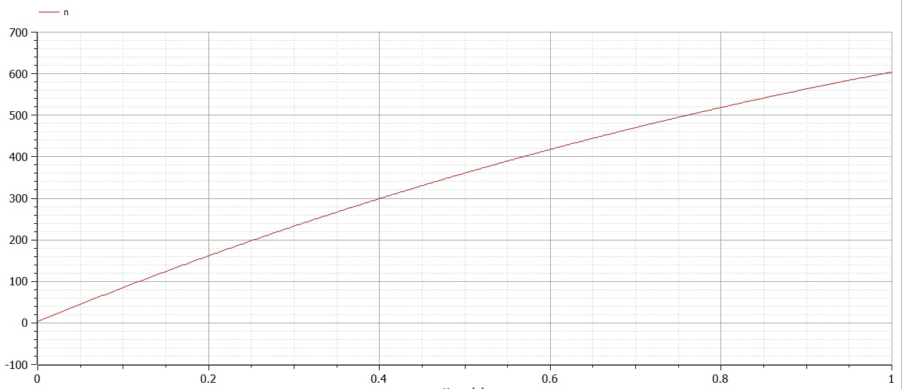
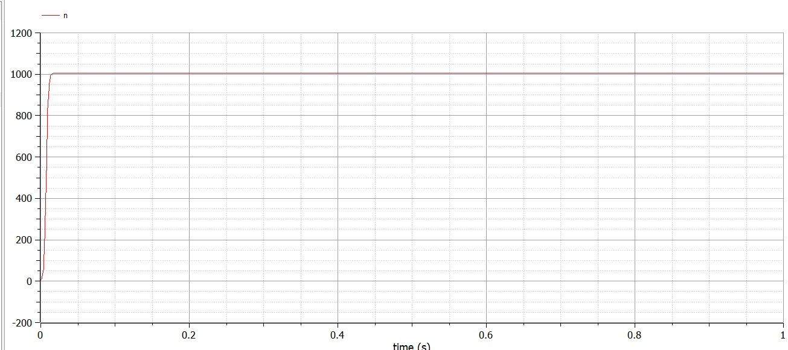

---
## Front matter
lang: ru-RU
title: Structural approach to the deep learning method
author: |
	Kuchenov I.V\inst{1,3}

## Formatting
toc: false
slide_level: 2
theme: metropolis
header-includes:
 - \metroset{progressbar=frametitle,sectionpage=progressbar,numbering=fraction}
 - '\makeatletter'
 - '\beamer@ignorenonframefalse'
 - '\makeatother'
aspectratio: 43
section-titles: true
---

# Модель рекламы

## Постановка задачи

## Цель

Цель - Построить график распространения рекламы, математическая модель которой описывается уравнением.

### Теоретическая часть:

1. Теоретическая часть.

Организуется рекламная кампания нового товара или услуги. Необходимо,
чтобы прибыль будущих продаж с избытком покрывала издержки на рекламу.
Вначале расходы могут превышать прибыль, поскольку лишь малая часть
потенциальных покупателей будет информирована о новинке. Затем, при
увеличении числа продаж, возрастает и прибыль, и, наконец, наступит момент, когда рынок насытиться, и рекламировать товар станет бесполезным. Предположим, что торговыми учреждениями реализуется некоторая продукция, о которой в момент времени t из числа потенциальных покупателей N знает лишь n покупателей. Для ускорения сбыта продукции запускается реклама по радио, телевидению и других средств массовой информации. После запуска рекламной кампании информация о продукции начнет распространяться среди потенциальных покупателей путем общения друг с другом. Таким образом, после запуска рекламных объявлений скорость изменения числа знающих о продукции людей пропорциональна как числу знающих о товаре покупателей, так и числу покупателей о нем не знающих.

Математическая модель распространения рекламы описывается уравнением:

# Ход решения

Мои значения:

Код:

Построение графиков:
Графики:

Первый график:

Второй график:

Третий график:

# Выводы
Результат: Построили график распространения рекламы, математическая модель которой описывается уравнением и увидели как будет вести себя реклама на графиках.

Вывод: Построили математическую модель, использовали OpenModelica, выявили результаты для двух случаев, научились строить математическую модель для нахождения исхода и результатов.
